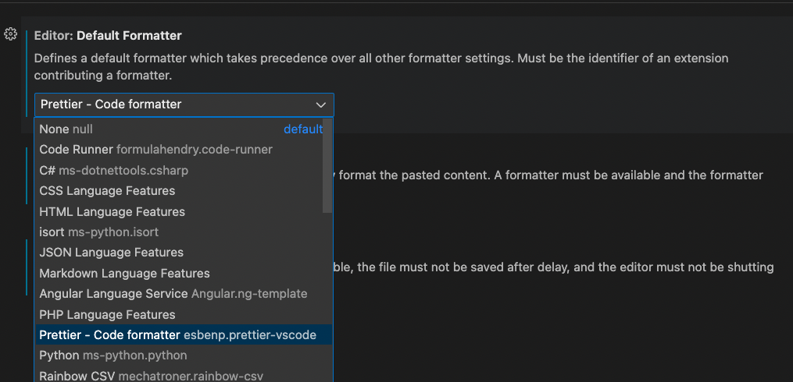

# Visual Studio Code Configuration

## Basics

1. Add "Open with Code" to Windows Explorer directory and file context menu.

   

1. [Turn on Autosave in VS Code](https://stackoverflow.com/a/56480358/48175)

1. [Configure Color Theme](https://code.visualstudio.com/docs/getstarted/themes)

1. [Configure File Icon Theme](https://code.visualstudio.com/docs/getstarted/themes#_file-icon-themes)

   > [Popular Color and File Icon Themes](https://marketplace.visualstudio.com/search?target=VSCode&category=Themes&sortBy=Installs)

## Extensions

[How to install an extension](https://code.visualstudio.com/docs/editor/extension-marketplace#:~:text=You%20can%20browse%20and%20install,on%20the%20VS%20Code%20Marketplace.)

Install these extensions.

### HTML

- [W3C Web Validator](https://marketplace.visualstudio.com/items?itemName=CelianRiboulet.webvalidator)
- [Prettier](https://marketplace.visualstudio.com/items?itemName=esbenp.prettier-vscode)
- [HTML End Tag Labels](https://marketplace.visualstudio.com/items?itemName=anteprimorac.html-end-tag-labels)

### CSS

- [CSS Peek](https://marketplace.visualstudio.com/items?itemName=pranaygp.vscode-css-peek)
- [HTML CSS Support](https://marketplace.visualstudio.com/items?itemName=ecmel.vscode-html-css)

### Git

- [Git Lens](https://marketplace.visualstudio.com/items?itemName=eamodio.gitlens)

## Settings

- Compact Folders

  Uncheck the box

  

- Editor: Default Formatter

  Set default formatter to prettier

  

- Format on Save

  Check the box

  

  > Warning: Autosave will not trigger formatting. You need to choose `File`> `Save` from the top menu or use the corresponding shortcut `Ctrl+S`

- Prettier: Print Width

  Set to 120 instead of the default of 80

  

- W3C Web Validator

  Uncheck Show Info

  Uncheck Validation Notification

  

- Disable Minimap

  

  

- Code Runner
  
